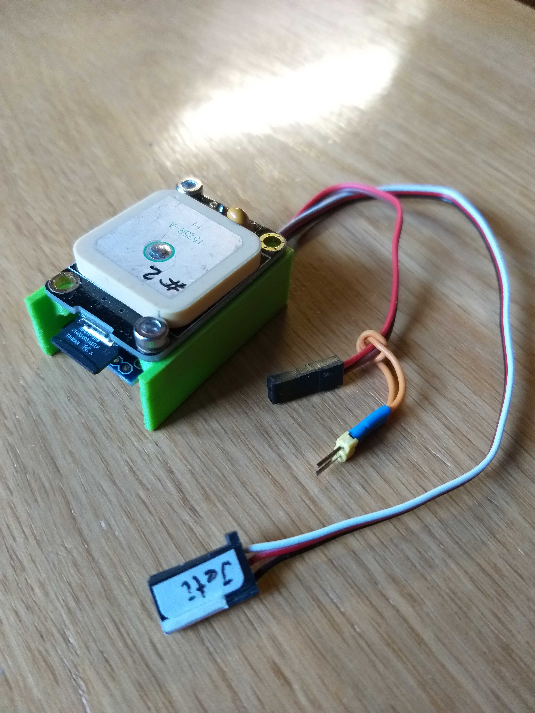
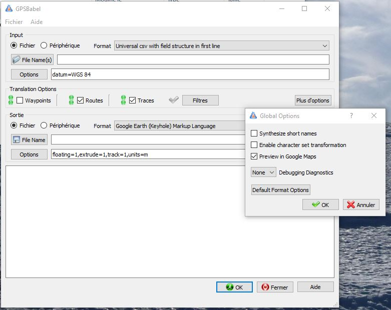

# GPS LOGGER

L’idée de départ était de réaliser un *data logger* pour enregistrer les évolutions d’un modèle réduit de planeur électrique afin de reproduire le vol en 3D dans Google Hearth.
Donc j’ai opté pour un petit module Arduino Pro Mini qui est monté en sandwich avec un module de carte micro-SD sous le module GPS de U-blox
Le tout est alimenté par une prise standard 3 pôles, disponible sur les récepteur de télécommande qui fourni les 5 V.
Un jumper mobile permet d’activer l’enregistrement des datas GPS. Il faudra aussi débrancher ce jumper avant de couper l’alimentation pour être sûr que le fichier soit fermé avant de retirer la carte SD.
Sur la photo on distingue sous la prise mini-USB du GPS la carte SD et les broches de l’Arduino que l’on peux atteindre avec le header mâle d’un module FTDI, pour éventuellement recharger un soft modifié.
Le fil de commande de la prise Jeti (un modèle de télécommande) permet d’accéder à la sortie Tx de l’Arduino pour d’éventuels tests.

<p align="center">

</p>

Les puristes remarqueront que les vis M3 ne sont pas trop dans l’optique du modélisme... mais les moteurs de ces planeurs sont puissants !
Par contre les plus performants ont des fuselages en fibre de carbone, pas trop perméables aux ondes radio des satellites (1.575 GHz) et lorsque le modèle vol sur le dos, une deuxième antenne sous le ventre pourrait améliorer la réception des signaux !!! Certains modules GPS ont une prise d’antenne (IPX ou/et SMA) supplémentaire.
Il y a donc de quoi passer du temps à peaufiner la solution.

Il faut savoir que le récepteur GPS a besoin de quelques minutes entre sa mise sous tension et le traitement des données reçues, que l’on nomme «éphémérides».
La LED du module clignote à la seconde dès que des données valides sont traitées.
Mais c’est l’heure qui est le paramètre acquis le plus rapidement.
Il faut l’acquisition d’au moins 3 satellites pour avoir un FIX Lat/Long, mais il en faut 4 pour avoir une altitude correcte en « mètres/mer ».
Cette dernière est corrigée par rapport à l’ellipsoïde et même si elle est entachée d’une erreur elle permet de voir très correctement les évolutions du modèle dans la 3e dimension.
En terrain découvert le module capte facilement 6 à 8 satellites et on obtient une précision de quelques mètres !
Il faut donc mettre le module sous tension quelques minutes avant l’envol de l’engin.
La précision ne dépend pas que du module, mais surtout de la forme de la « constellation » ; soit la position relative des satellites visibles à un moment donné.
Cette précision sera d’autant meilleure que les satellites visibles forment une figure d’une grande surface, à l’opposé, s’ils se trouvent tous sur une ligne, la précision sera mauvaise.
Les modules U-blox que j’ai utilisés (Neo-6M à 2.50 CHF) ne reçoivent que le système GPS (USA), des modules un peu plus chers (Neo-8M à 6.50 CHF) reçoivent les 4 systèmes GPS/US, Beidou/Chine, Glonass/Russe, Gallileo/€urope.
Ils devraient voir plus de satellites, donc avoir une meilleurs précision, mais des vidéos d’Andreas Spiess démontrent que ce n’est « pas toujours vrai » !?

## Expériences

Le premier montage avec l’Arduino NANO étant « embarqué », il ne comportait pas d’affichage, je n’ai fait que des tests en statique, avec des paramètres sortis par le port série via un bridge FTDI.
Alors pour « l’embarquer » en voiture par exemple (quand je suis que passager !) j’ai monté un petit OLED pour voir en temps réel ce qui se passe.
C’est assez sympa de voir sa vitesse et son cap ! Ça pourrait même être utile sur un voilier.

## Affichage OLED

```
ligne 1 : mois, jour, heure GMT
ligne 2 : latitude, longitude
ligne 3 : S = nbre de satellites utilisés pour les calculs
          P = HDOP (une « image » de la précision, voir définition sur internet)
          vitesse de déplacement horizontale en km/h
ligne 4 : altitude en m/M, cap de déplacement
```

**1er problème :**
Pour avoir des valeurs de navigation au rythme de la seconde avec un module GPS qui livre ses données à 9600 Bauds, il faut limiter les données afin d’avoir le temps de les traiter et/ou de les afficher avant l’arrivée du « train » de données suivant !
Ces données sont des «trames NMEA» dont le contenu est normalisé et bien défini.
Après essais, je limite le transfert à 2 trames au lieu d’une dizaine.
Pour ce faire il faut reconfigurer les modules GPS avec le soft « u-center » mis gratuitement à disposition par U-blox.
Les modules ont des sorties I²C, SPI, USB, USART_1 et USART_2.

**Correction :**
On laisse sortir toutes les trames sur l’USB et l’I2C et on ne laisse que les 2 trames GGA et RMC sortir sur l’UART_1 qui alimente le processeur.
Les explications sont en commentaires dans MAIN.CPP.

**2e problème :**
L’ajout de l’OLED « charge » assez l’Arduino et il n’est possible d’afficher que si l’on enregistre pas !
J’ai remarqué ça avec des affichages de valeurs impossibles de HDOP et au bout de quelques minutes tout plante.
Pourtant j’utilise une police de caractères non graphique pour économiser de la place (la lib graphique se compile correctement, mais PIO annonce une utilisation de la RAM à 135 %).

**Correction :**
Changement de processeur , adoption d’un WEMOS-D1_mini-lite à 2.50 CHF.

Avec une clock à 80 MHz, ses 1 MB de *flash*, 80 kB de RAM et bien qu’ayant un noyau RTOS tournant en arrière-plan... on n’est pas trop gênés...
On peut afficher et enregistrer en même temps.

## Utilisation de l’enregistrement

Le fichier généré « trajet.csv » peut être vu dans un tableur (pour y faire des calculs !?), toutefois un programme de conversion se nommant « GPSBabel » peut vous rendre service !
Il permet de reprendre le « trajet.csv » au format « unicsv » et de le demander en sortie au format Google KML avec « Preview dans Google Maps ».
Vous pouvez encore régler quelques options pour la sortie KML, à vous d’essayer et de voir ce qui vous plaît...

<p align="center">

</p>

Par la suite vous pouvez ouvrir ce fichier .KML avec Google Hearth, mais personnellement je préfère la vue dans Google Maps.

Comme il y a un record chaque fois que la distance parcourue par rapport au point précédent est supérieure à 10 m.
Mais en voiture on est vite en dessus de 10 m/s (36 km/h) donc on a dès cette vitesse un record à chaque seconde quand même.

Il y a en annexe un trajet que j’ai enregistré lors d’un déplacement de test, le module était dans le coffre de la voiture avec tout de même une antenne magnétique sur le toit (connecteur SMA).
Le module a été enclenché aux environs de 0800h UTC et arrêté vers 1240h UTC... et il n’y a aucun record pendant les arrêts !

Vous trouverez aussi quelques photos, les schémas et les fichiers sources (PlatformIO ; mais vous pouvez les reprendre dans Arduino si vous chargez les librairies mentionnées dans le « platformio.ini »).

... bon amusement ...

Alain
